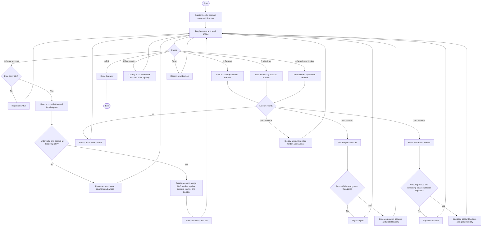

# Console Banking System Flowchart

```mermaid
flowchart TD
    A([Start]) --> B[Create five-slot account array and Scanner]
    B --> C[Display menu and read choice]
    C --> D{Choice}

    D -->|1 Create account| E{Free array slot?}
    E -->|No| E1[Report array full]
    E1 --> C
    E -->|Yes| E2[Read account holder and initial deposit]
    E2 --> E3{Holder valid and deposit at least Php 500?}
    E3 -->|No| E4[Reject account; leave counters unchanged]
    E4 --> C
    E3 -->|Yes| E5[Create account; assign ACC number; update account counter and liquidity]
    E5 --> E6[Store account in free slot]
    E6 --> C

    D -->|2 Deposit| F[Find account by account number]
    D -->|3 Withdraw| G[Find account by account number]
    D -->|4 Search and display| H[Find account by account number]
    F --> I{Account found?}
    G --> I
    H --> I
    I -->|No| I1[Report account not found]
    I1 --> C
    I -->|Yes, choice 2| J[Read deposit amount]
    J --> J1{Amount finite and greater than zero?}
    J1 -->|No| J2[Reject deposit]
    J2 --> C
    J1 -->|Yes| J3[Increase account balance and global liquidity]
    J3 --> C
    I -->|Yes, choice 3| K[Read withdrawal amount]
    K --> K1{Amount positive and remaining balance at least Php 100?}
    K1 -->|No| K2[Reject withdrawal]
    K2 --> C
    K1 -->|Yes| K3[Decrease account balance and global liquidity]
    K3 --> C
    I -->|Yes, choice 4| L[Display account number, holder, and balance]
    L --> C

    D -->|5 View metrics| M[Display account counter and total bank liquidity]
    M --> C
    D -->|6 Exit| N[Close Scanner]
    N --> O([End])
    D -->|Other| P[Report invalid option]
    P --> C
```